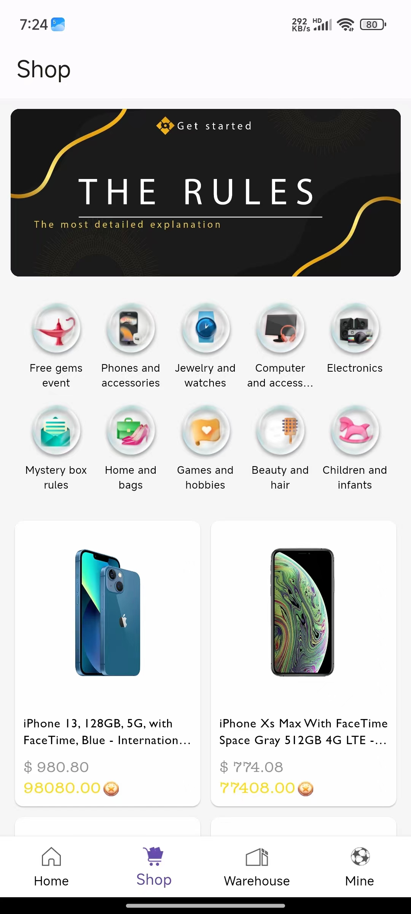
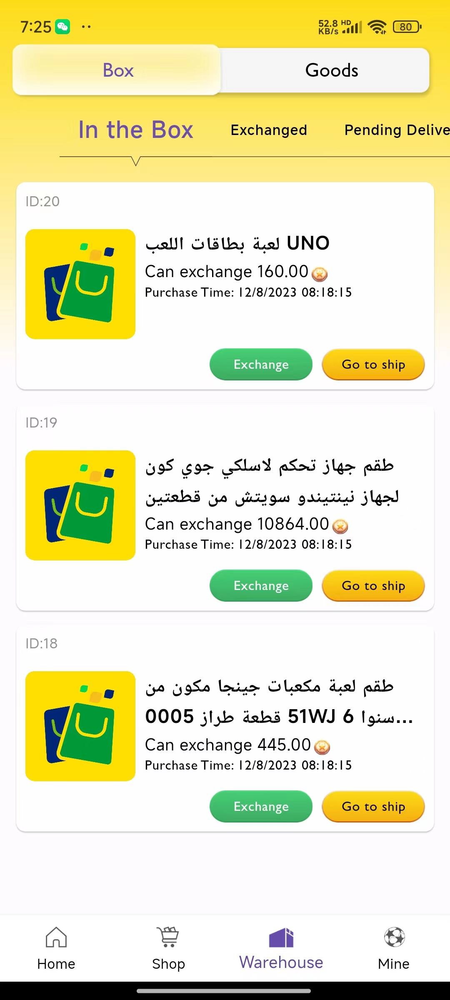
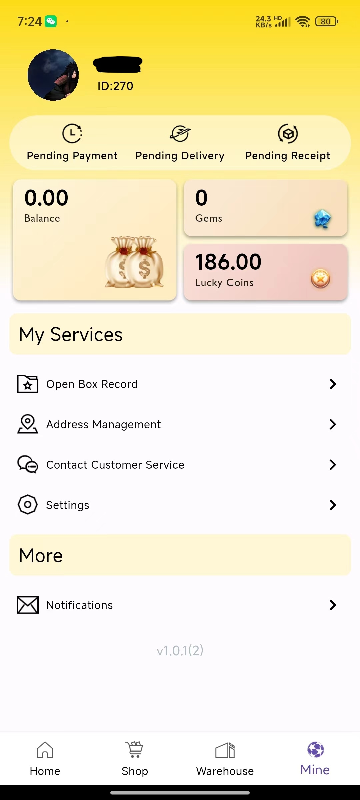
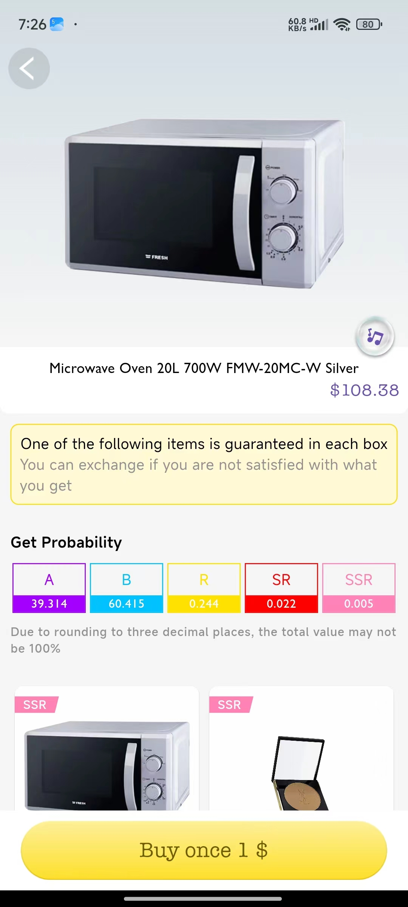
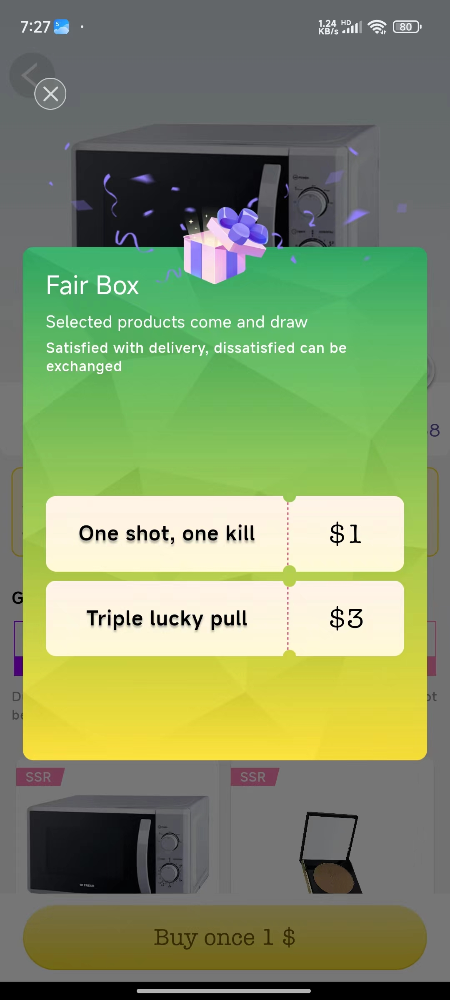
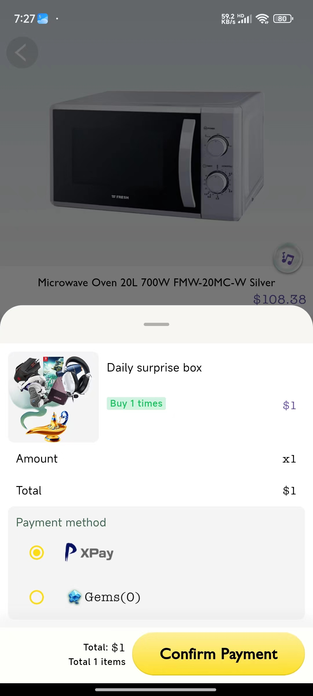
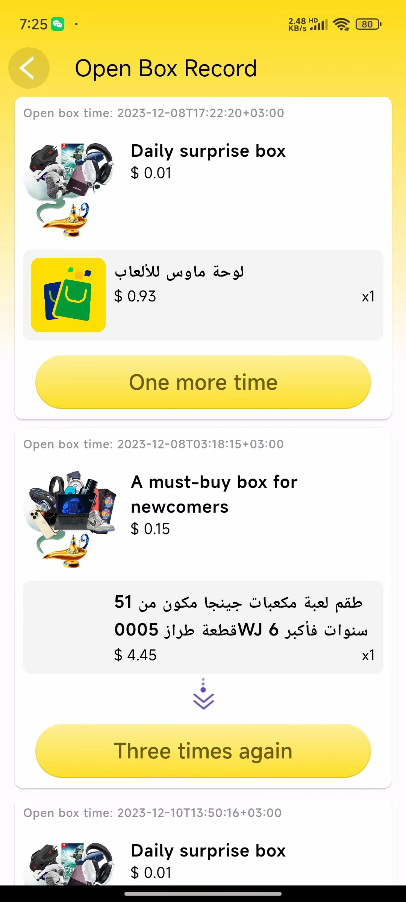

# e_commerce_app


去年做了几个Flutter应用，同一套代码fork了几个分支（如下截图是最新的一个分支实现），花点时间整理一个简单的APP工程模版：

1. 最小依赖原则
1. 之前只面向移动端，这次代码整理主要适配web
1. 只把涉及到的且常用的功能摘出来，尽量简化实现，方便后面项目复用

<table>
  <tr>
    <td><br>home</td>
    <td><br>shop</td>
    <td><br>warehouse</td>
    <td><br>mine</td>
  </tr>
  <tr>
    <td><br>detail</td>
    <td><br>select</td>
    <td><br>checkout</td>
    <td><br>open box record</td>
  </tr>
</table>

# 功能：
1. 国际化
1. 自定义字体
1. 首页
    * 轮播图
1. Google登录


# 依赖组件：
**必选**
1. intl 国际化
1. dio 网络交互
1. shared_preferences 本地存储
1. injectable 依赖注入
1. logger 日志
1. card_swiper 轮播图
1. google_sign_in 谷歌登录
1. firebase_analytics firebase分析
1. fluttertoast toast


**可选**
1. shimmer 骨架加载动画
1. cached_network_image 图片缓存( Web不可用 )

# Mock API
* https://xeno-canto.org/explore/api (flutter web 有跨域问题，运行时禁用web-security)
```bash
flutter run -d chrome --web-browser-flag "--disable-web-security" 
```

# 组件配置
* injectable

依赖注入，定义`di.dart`文件
```dart
@InjectableInit()
Future<void> configureDependencies() async => await GetIt.instance.init();
```
添加injectable_generator插件，可以自动生成di.config.dart文件
```
flutter pub add dev:injectable_generator
```

在main.dart初始化
```dart
Future<void> main() async {
  await configureDependencies();
  runApp(const MainApp());
}
```


以SharedPreferences为例，全局注入SharedPreferences实例，避免非async方法里使用时await问题。
```dart
@module
abstract class SharedPreferenceService {
  @preResolve
  Future<SharedPreferences> get prefs => SharedPreferences.getInstance();
}
```